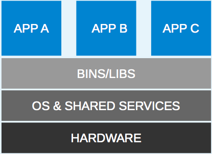
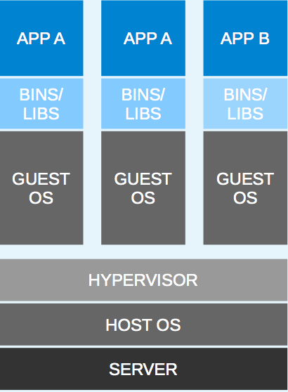

# A Brief History of Virtualization

### Hardware Centric Development

In the beginning of the IT revolution, applications were deployed directly on the hardware.  All of the applications that lived on that hardware were on the same OS. As a result, all of the applications shared the same namespace.  This meant that each application had a single user space, and all shared the same runtime environment.  Applications were hardware-centric, had long maintenance cycles, and gave developers very little flexibility.

To make this clear, let's adopt some community living analogies. Imagine a community of people that all live in different types of houses.  There are normal houses, duplexes, and apartments. This hardware-centric approach is analogous to a house ( physical machine ).  It's extremely secure, and if one house is broken into, the rest of the community is still secure.  Although having a bunch of separate houses is a lot of maintenance.

### Virtualization, Woah!

To combat the limitations set forth by a hardware centric approach, virtualization was invented!  With hypervisors such as KVM, ESX, and many more, we were able to emulate the hardware for virtual machines and deploy a guest OS on each VM.  Unlike the hardware-centric approach, each VM can have it's own OS on it.  This means that we must patch, update and secure each VM.  It also allowed us to isolate applications, and gave developers much more flexibility.

Let's go back to our community living example:  In this situation the virtualized environments on one piece of hardware is analogous to a duplex.  Even though the physical structure is shared, the entry point is not. If one home in the duplex is compromised, the other is still relatively safe. Breaking into the other home requires the attacker to break through the hypervisor, sVirt, and the host kernel.  Not an easy task.  Although this is a good approach, we still need to maintain multiple OS's, and we're still limited by speed and an inability to share resources.

### Application Centric Development (containers)

Containers have been around for a while now, but only recently have they seen more mass appeal.  In a nut shell, containers are when applications are packaged with their runtime environments and deployed using containers, OpenVZ, and Solaris Zones are a few examples.  First off, containers are less flexible than VM's.  For example, we can't run Microsoft Windows on a Linux OS.  Containers are also considered less secure than VM's.  If you break into one container, you own the entire OS.  They were also hard to set up and maintain.  So why did Docker change the game?

### Docker

According to the Docker website: 

> Docker allows you to package an application with all of its dependencies into a standardized unit for software development.

Source: https://rhsummit.files.wordpress.com/2014/04/rhsummit2014-application-centric_packaging_with_docker_and_linux_containers-20140412riek7.pdf

